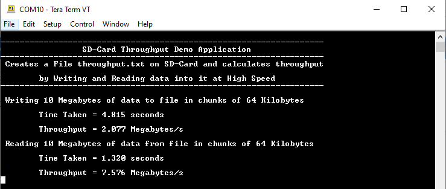

# FAT filesystem throughput using SDMMC Media

This application calculates throughput by Writing and Reading data into a Sd-Card at High Speed using the MPLAB Harmony File System and the SDMMC driver.

## Description

### Application performs below filesystem operations and throughput calculations on SD-Card

- Opens a file named **throughput.txt** in the root directory of the SD card
- Writes 10 Megabytes of data to file in chunks of 64 Kilobytes
- Once the operation is completed it calculates the time taken and overall throughtput for write in **Megabytes/second** and displays on the console
- Reads 10 Megabytes of data from file in chunks of 64 Kilobytes
- Once the operation is completed it calculates the time taken and overall throughtput for reading in **Megabytes/second** and displays on the console
- Closes the file once read is completed
- It then Glows an LED reporting success and the console will have throughput information for read and write operations.

### File system layer uses:

- SDMMC Driver to communicate to SD Card

## Downloading and building the application

To clone or download this application from Github, go to the [main page of this repository](https://github.com/Microchip-MPLAB-Harmony/core_apps_sam_d5x_e5x) and then click Clone button to clone this repository or download as zip file.
This content can also be downloaded using content manager by following these [instructions](https://github.com/Microchip-MPLAB-Harmony/contentmanager/wiki).

Path of the application within the repository is **apps/fs/sdmmc_fat_throughput/firmware** .

To build the application, refer to the following table and open the project using its IDE.

| Project Name      | Description                                    |
| ----------------- | ---------------------------------------------- |
| sam_e54_xpro.X | MPLABX project for [SAM E54 Xplained Pro Evaluation Kit](https://www.microchip.com/developmenttools/ProductDetails/atsame54-xpro) |
|||

## Setting up the hardware

The following table shows the target hardware for the application projects.

| Project Name| Board|
|:---------|:---------:|
| sam_e54_xpro.X | [SAM E54 Xplained Pro Evaluation Kit](https://www.microchip.com/developmenttools/ProductDetails/atsame54-xpro) |
|||

- To run the demo, the following additional hardware are required:
    - One Sd card
        - The SD Card should have atleast 10MB of free space for the demo to work

### Setting up [SAM E54 Xplained Pro Evaluation Kit](https://www.microchip.com/developmenttools/ProductDetails/atsame54-xpro)

- Connect the Debug USB port on the board to the computer using a micro USB cable

## Running the Application

1. Open the Terminal application (Ex.:Tera term) on the computer
2. Connect to the "USB to UART" COM port and configure the serial settings as follows:
    - Baud : 115200
    - Data : 8 Bits
    - Parity : None
    - Stop : 1 Bit
    - Flow Control : None

3. Build and program the application using its IDE

4. Following message is output on console:

   

5. Insert the SD Card in the SD Card slot of the Device
6. The LED is turned ON if there was no error during the file operations

    Refer to the following table for LED name:

    | Board | LED Name |
    | ----- | -------- |
    |  [SAM E54 Xplained Pro Evaluation Kit](https://www.microchip.com/developmenttools/ProductDetails/atsame54-xpro) | LED0 |
    |||

7. Calculated throughput values are dispalyed on console as below:
    - **Note:** The Values showed in the below output may differ slightly when demo is run

   
