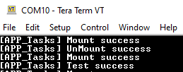

# LittleFS filesystem using SD Card media

This application shows an example of using the LittleFS File System to access SD card using the SDSPI driver and the SPI PLIB.

## Description

### File System Operations on the SD Card

- Performs a SYS_FS_FormatDisk
- Opens a **newfile.txt** on the SD Card
- Write and reads back 4KB of data on **newfile.txt**
- Verifies the Data Read back

### File system layer uses:

SDSPI Driver to communicate to SD Card over SPI interface.

## Downloading and building the application

To clone or download this application from Github, go to the [main page of this repository](https://github.com/Microchip-MPLAB-Harmony/core_apps_sam_d5x_e5x) and then click Clone button to clone this repository or download as zip file.
This content can also be downloaded using content manager by following these [instructions](https://github.com/Microchip-MPLAB-Harmony/contentmanager/wiki).

Path of the application within the repository is **apps/fs/sdspi_littlefs/firmware** .

To build the application, refer to the following table and open the project using its IDE.

| Project Name      | Description                                    |
| ----------------- | ---------------------------------------------- |
| sam_e54_xpro_freertos.X | MPLABX project for [SAM E54 Xplained Pro Evaluation Kit](https://www.microchip.com/developmenttools/ProductDetails/atsame54-xpro) |
|||

## Setting up the hardware

The following table shows the target hardware for the application projects.

| Project Name| Board|
|:---------|:---------:|
| sam_e54_xpro_freertos.X | [SAM E54 Xplained Pro Evaluation Kit](https://www.microchip.com/developmenttools/ProductDetails/atsame54-xpro) |
|||

### Setting up [SAM E54 Xplained Pro Evaluation Kit](https://www.microchip.com/developmenttools/ProductDetails/atsame54-xpro)

- To run the demo, the following additional hardware are required:
  - [I/O1 Xplained Pro Extension Kit](https://www.microchip.com/developmenttools/ProductDetails/ATIO1-XPRO)
  - Micro-SD card formatted to LittleFS filesystem
- Connect the [I/O1 Xplained Pro Extension Kit](https://www.microchip.com/developmenttools/ProductDetails/ATIO1-XPRO) to the EXT1 header
- Insert microSD card on the [I/O1 Xplained Pro Extension Kit](https://www.microchip.com/developmenttools/ProductDetails/ATIO1-XPRO)
- Connect the Debug USB port on the board to the computer using a micro USB cable

## Running the Application

1. Open the Terminal application (Ex.:Tera term) on the computer
2. Connect to the EDBG Virtual COM port and configure the serial settings as follows:
    - Baud : 115200
    - Data : 8 Bits
    - Parity : None
    - Stop : 1 Bit
    - Flow Control : None

3. Build and program the application using its IDE
4. Press the switch to start the application
5. The LED is turned ON if data has successfully been written and read back from file "newfile.txt"

    Refer to the following table for LED name:

    | Board | LED Name | Switch Name |
    | ----- | -------- | ----------- |
    |  [SAM E54 Xplained Pro Evaluation Kit](https://www.microchip.com/developmenttools/ProductDetails/atsame54-xpro) | LED0 | SW0 |
    |||

6. Observe the following messages getting printed on the console

    
